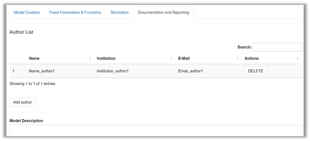
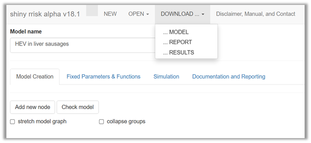

# Documenting and reporting

::: {.callout-note appearance="minimal"}
#### This section will introduce you to

- using shiny rrisk's interface for a general model description,
- structuring your description using simple markdown syntax,
- adjusting the level of documentation to specific requirements 
- launching the automatic reporting function.
:::

## Adding general model description 

A comprehensive documentation of a model requires a few more details to be provided. This part of documentation is optional but highly recommended (@fig-Documentation).

{#fig-Documentation width="100%"}

Under **Author list**  you can disclose who assumes the scientific responsibility for the work. Later versions of shiny rrisk will allow that a corresponding author is indicated. 

Under **Model description** you will find a free text field that is meant to capture the general description of the model. In the absence of a generally accepted standard structure for this purpose you have the flexibility to generate a structure that meets your needs. Below are some recommendations for best practices that you can combine in the free text field to meet your specific reporting needs. A simple Markdown syntax can be used to structure the description into sections and subsections. Markdown syntax can also be used to generate some standard text formatting.

::: {.callout-tip collapse="true"}
## Good practice: Generic structure for model description 
The suggested first-level headers below can be pasted into the free text field for **Model description**. The symbol `\#' at the beginning of text lines  ensures that the rendered model report uses the  format for first order headers. Use whatever meets your reporting requirement and delete what is not needed. See the Alizarin red in eel model for a more elaborated model description. 

**\# Preamble** 

This section may provide a link to some main document to which the model report is an annex.

**\#  Abbreviations**

A list of abbreviations used in the documentation may useful. 

**\# Background**

The motivation for the work and a summary of current scientific knowledge may be provided here.

**\# Objectives**

It is highly recommended to formulate the objectives of the specific modelling task.

**\# Scope**

This section states aspects of the model that are explicitly included or excluded. Such aspects may pertain to the hazard identification or the scenario (e.g., exposure and risk pathways, populations and risk factors). 

**\# Model description**

This section contains a summary description of the model. Parts or modules of the model, when used in the definition of nodes, can be described separately using sub-sections, marked with `\##'. 

**\# Uncertainty assessment**

We recommend that major sources of uncertainty are documented as described by [Heinemeyer et al., 2022](https://www.bfr.bund.de/cm/349/guidance-on-uncertainty-analysis-in-exposure-assessment.pdf). The Alizarin red S in Eel model provides an example for specifying uncertainties pertaining to the scenario (agents, sources, populations, microenvironment, time, activities, pathways, space), modelling approach (concept, structure, dependencies, outcome) and other sources (question formulation, context, protection perspective, population group, protection goal, protection level, scope.

**\# Results **

This section may be used to summarise the main results of the model. Reference should be made to **tables** and **graphs** which are automatically embedded in the reporting document. It is recommended to describe the outcome of the model (end node) using **median** and appropriate upper **percentile**. The **uncertainty intervals** should be stated when a 2D model has been used. The results of the **sensitivity analysis** should be interpreted.   

**\# Conclusions**

This section may be used to formulate the conclusions from the model.

**\# Acknowledgement **

Contributions should be acknowledged.

**\# References**

This section may contain a list of references. 

:::

::: {.callout-caution collapse="true"}
## Read more: Markdown syntax

Markdown syntax is recommended to provide subheadings in free text fields. The Alizarin red S in Eel model provides an example of markdown in the description of the model and model parameters (e.g., bootstrapping). Markdown is also available in free text fields to generate formatted output in the report file. Some examples are given below (@fig-Markdown).

{#fig-Markdown width="100%"}

You can find more information at [RStudio, 2016](https://rmarkdown.rstudio.com/authoring_basics.html) .
:::

## Automatic reporting 

Shiny rrisk has the unique feature that allows you to produce reports that can facilitate the communication of the model to interested parties. The key concept is the **integrated model documentation**. You have noted the pre-structured documentation for each node and the flexiblity to add documentation at the level of the model (see above). Now it is time to earn the benefit from this investment of time and effort (@fig-reporting).

{#fig-reporting width="100%"}

The **Results** option will generate datasets in "\*.csv" format [@Robert **- no working so not sure what I am getting**]

