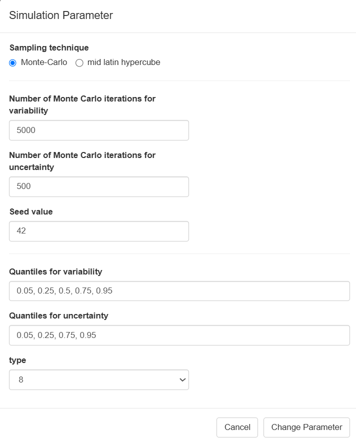
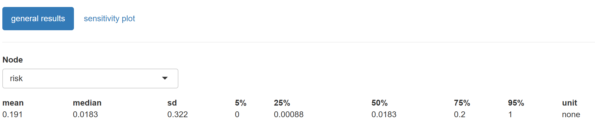
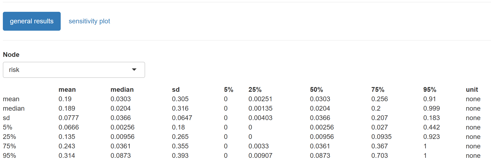
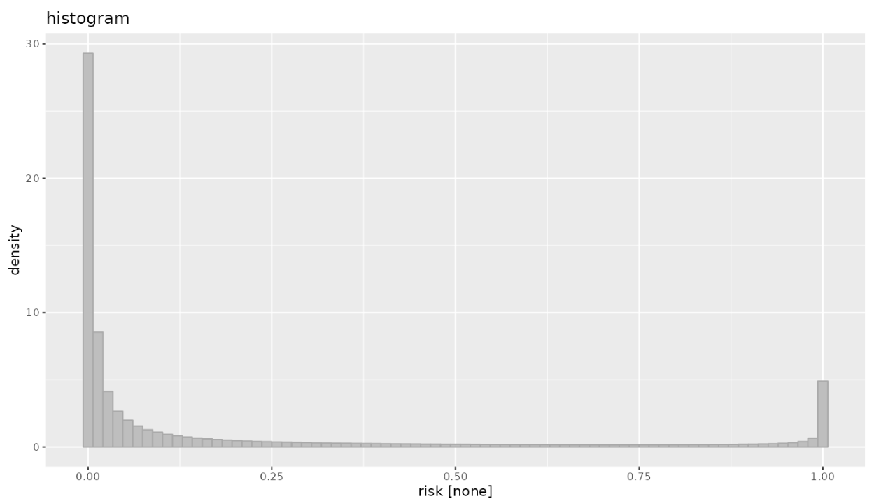
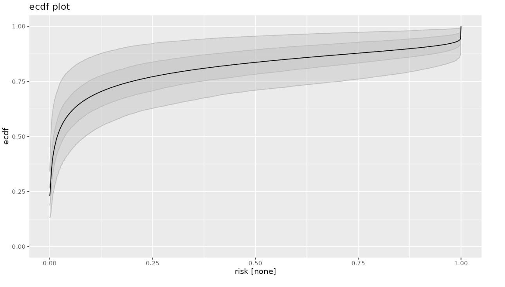
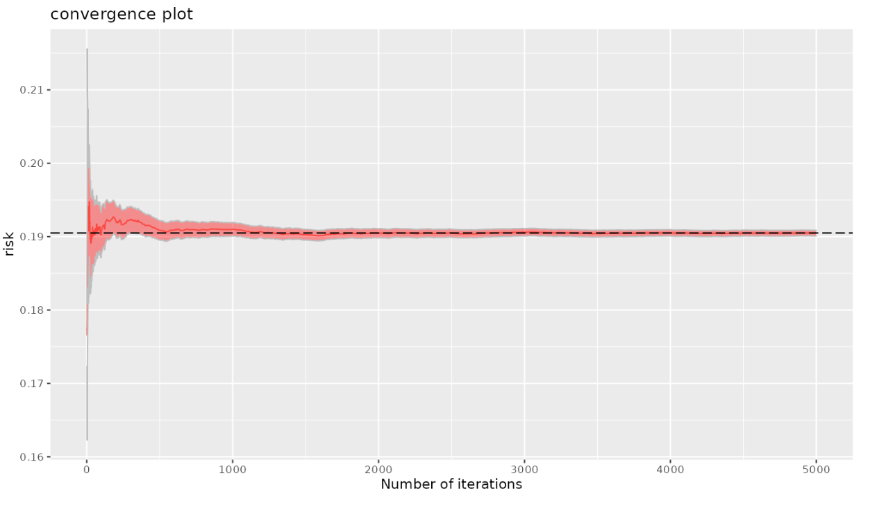

# Running a simulation

::: {.callout-note appearance="minimal"}
#### This section will introduce you to

-   obtaining model result interface
-   interpreting model results
-   Interpreting sensitivity analysis
:::

{#fig-simulation width="100%"}

Before executing (run) the simulation, user can set up several parameters by clicking **Set run parameter**. After setting these parameters, click **Change Parameter.**

{style="border: 2px solid black;  box-shadow: 4px 4px 12px rgba(0, 0, 0, 0.6);" width="334"}

|                                                                                         |                                                                                                       |
|---------------------------------|--------------------------------------|
| [SAMPLING TECHNIQUE]{style="color:#0d6efd"}                                             | Select the random sampling method                                                                     |
| [NUMBER OF MONTE CARLO SIMULATIONS: VARIABILITY and UNCERTAINTY]{style="color:#0d6efd"} | Enter here the number of Monte Carlo random samples required for the simulation                       |
| [QUANTILES: VARIABILITY and UNCERTAINTY]{style="color:#0d6efd"}                         | Enter here the percentiles for summarizing model results in the variability (1D) and uncertainty (2D) |
| [SEED VALUE]{style="color:#0d6efd"}                                                     | Enter the integer number, this will allow to reproduce the same results                               |
| [TYPE]{style="color:#0d6efd"}                                                           | ?@Robert                                                                                              |

After setting all the parameters, select **Run Simulation.** After the simulation is completed, shiny rrisk will present the another screen, with the **general results** (by default) and **sensitivity plot.**

@Robert - change to Sensitivity Analysis \[change names in boxes to upper case to be consistent with other boxes\]

::: {.callout-warning appearance="simple"}
#### Memory

The shiny rrisk server allocates a maximum memory of \@\@\@ ro run the simulation. The amount of memory used is influenced by the number of nodes and the number of number samples required in the variability and uncertainty dimensions.
:::

::: {.callout-tip collapse="true"}
### Good practice - Number of MC samples

Since the number of nodes is part of the structure of the model, the amount of memory used will mainly depend of the number of random samples.

Usually, the number of samples are selected based on standard "magic" numbers, like 100, 1000, 10000, etc. However, there are some approaches that can be followed as a guidance to estimate an approximate number.

Usually, in risk and exposure assessments, the outcome is rare and large number of samples are required to obtain meaningful statistics.

If the true risk is rare, and you want at least n occurrences of the event, then you can use:

$N>= n/p$

Example: to observe at least 1 event with a p = 10-4

N \>= 1/0.00001 = 10,0000 samples

Usually, the appropriated number of samples is an iterative exercise, where different simulations are run until we obtain consistent values for up to two/three digits of the mean or median.

Also, we can use consistent values within 0.005 for the 2.5% and 97.5% percentiles.

The convergence plot presented below can also be used as a guidance about the number of samples required to obtain a consistent mean estimate.

@need something about sampling methods maybe here for efficient number of samples
:::

::: {.callout-caution collapse="true"}
## Read more - Sampling methods

Two sampling methods can be used in shiny rrisk. The Latin Hypercube (LH) method is more efficient and will provide same accuracy as the Monte Carlo (MC) method with fewer samples. In addition the LH will assure that samples are taken from the whole distribution, which is also better for rare events. The LH might reduce the number of samples required by a factor of 10 compared with the MC method. The LH is the default method in shiny rrisk.

The LH method divides each random variable's range into equal probability intervals (strata) according the number of samples required in the simulation and then take one sample from each interval per variable. Then the full coverage of each variable is sampled.

The graph below shows a simple example of how the LH sampling has a better coverage of the sampling space as compared to the MC method.

The table below compare the sampling methods to the True risk after taken 80 samples for two variables

|     Method      | Sample Size | Mean Risk | S.E.  |
|:---------------:|:-----------:|:---------:|:-----:|
|      True       |    ----     |   0.017   |  \-   |
|   Monte Carlo   |     80      |   0.038   | 0.021 |
| Latin Hypercube |     80      |   0.013   | 0.012 |
:::

## General Results

The results of all the nodes can be visualized from the drop down menu under Node. By default, shiny rrisk will start with the final node (eg. star shape node - or outcome).

### Numerical result table

The output table will provide the summary statistics of each node according to the dimensions in variability and uncertainty. In addition, shiny rrisk will provide three plots in the natural scale or log10 transformed scale for summarizing the results.

#### One dimension Monte Carlo Model (1D MC) - Only Variability

The table below shows the results of the one dimension simulation for the E. coli in beef patties model after selecting 5000 random samples.

{style="border: 2px solid black;  box-shadow: 4px 4px 12px rgba(0, 0, 0, 0.6);"}

For 1D models, the results will be presented in only one row representing the variability of the node.

#### Two dimensions Monte Carlo Models (2D MC)- Variability and Uncertainty

The table below shows the results of the two dimension simulation for the E. coli in beef patties model after selecting 5000 and 500 random samples for the variability and uncertainty dimensions, respectively.

{style="border: 2px solid black;  box-shadow: 4px 4px 12px rgba(0, 0, 0, 0.6);"}

For 2D models, the summary statistics are presented in a matrix format, where rows represent uncertainty and the columns, the variability of the node.

### Summary Plots

#### Histogram

This plot depicts the density distribution of the random values for a given node.

{style="border: 2px solid black;  box-shadow: 4px 4px 12px rgba(0, 0, 0, 0.6);" width="500"}

#### ECDF plot

This is the empirical cumulative density function plot, it is presented as an ascending cumulative plot. See read more for the proper interpretation of the graph.

{style="border: 2px solid black;  box-shadow: 4px 4px 12px rgba(0, 0, 0, 0.6);" width="500"}

#### Convergence plot

@Robert - how to interpret this one?

{style="border: 2px solid black;  box-shadow: 4px 4px 12px rgba(0, 0, 0, 0.6);" width="500"}

::: {.callout-caution collapse="true"}
## Read more - 2d MC Models

The following figure depicts the outcome of a probabilistic model that reflects both variability and uncertainty (2d MC). 

The central tendency (median) of the risk estimate can be read from the intersection of the dark blue line with the red line parallel to the x-axis at a probability value in the y-axis of 0.5. The value is around 1e-11.

The 95th percentile (P95) provides an estimate of the risk that captures 95% of the variability of the input parameters. It can be read from the graph by looking at the x-axis where upper red lines intersects with the dark blue line.

The uncertainty of the median and 95th can be read from range of values across the red lines for each statistic. The red lines represents the 95% probability intervals for the median and 95th percentile. For instance, the upper boundary of a 95 % uncertainty range for the P95 estimate when accounting for uncertainty is 1e-10.
:::

## Sensitivity Plot

{style="border: 2px solid black;  box-shadow: 4px 4px 12px rgba(0, 0, 0, 0.6);" width="500"}

The sensitivity analyses results can be visualized by selecting the **sensitivity plot** tab in the main screen after running the simulation. Shiny rrisk will produce a tornado plot using two stasticts, "Pearson correlation coefficient" and "Spearman rho statistic" (the R2 statistic will be implemented in future versions of shiny rrisk).

The following plots presents the 2D tornado plot using the Pearson statistic for the E. coli model. All the input variables are postively correlation withe outcome (eg. the larger is the value of the input, the larger is the risk). However there are major differences in the influence of each input variable on the outcome. For instance the initial concentration of the pathogen (log10_C0) has a Pearson correlation coefficient of approximately 0.6 followed by the reduction facors and concentration.

Since this is a 2D model, the tornado plot also present the 95%. probability interval due to the uncertainty of the risk outcome.

{style="border: 2px solid black;  box-shadow: 4px 4px 12px rgba(0, 0, 0, 0.6);" width="500"}

::: {.callout-caution collapse="true"}
## Read more: Tornado plots

Tornado plots are commonly used in risk and exposure assessments models to assess the quantify the impact of input variables on the outcome of the model. This relationship is quantified using parametric (eg. Pearson correlation coefficient) or non-parametric (eg. Spearman rank correlation coefficient - rho -) statistics.

The graphs is created using all the input variables on the y-axis and the statistic on the x-axis, then the relationship is depicted using horizontal bars where the length of the bar represents the value of the statistic. This value is constraint by the boundaries of the statistic (eg. between -1 and 1). Where values below 0 represent an inverse relationship and values greater than 0, otherwise. For instance negative values suggest that higher values of the input are associates with lower values of the outcome variable.

In addition, for 2D models, each input variable has a line indicating the 95% probability interval of the relationship due to the uncertainty propagated in the model.

**Pearson correlation coefficient**. The relationship is captured assuming a linear relationship between the input variable and the outcome using the Pearson correlation coefficient.

**Spearman rank correlation**. The relationship is captured using the non-parametric rank correlation which does not assume any particulate shape of the relationship between the input and outcome.

This graphs are called "tornado" because the shape of the graphs resembles a "tornado", funnel like shape since the variables ara sorted from highest values on the top to the lowest at the bottom.
:::

