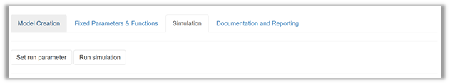
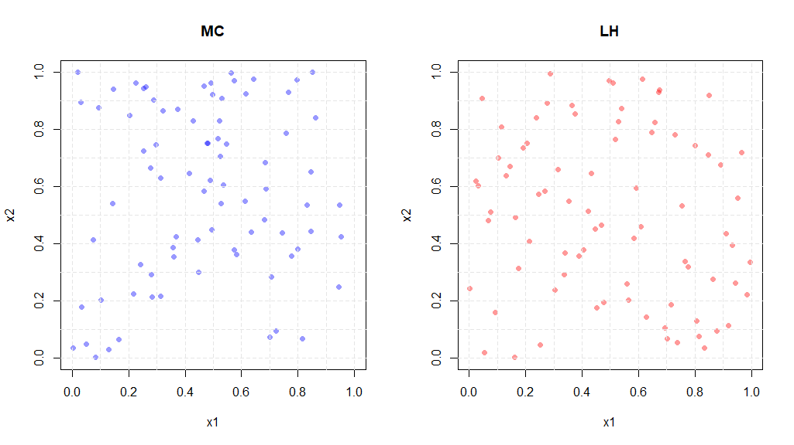
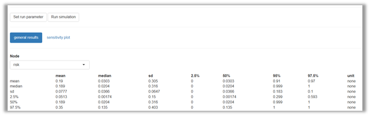
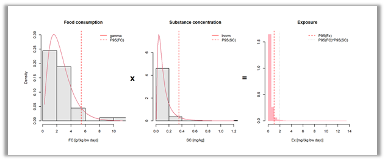
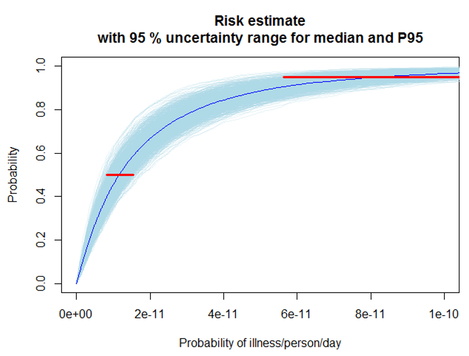
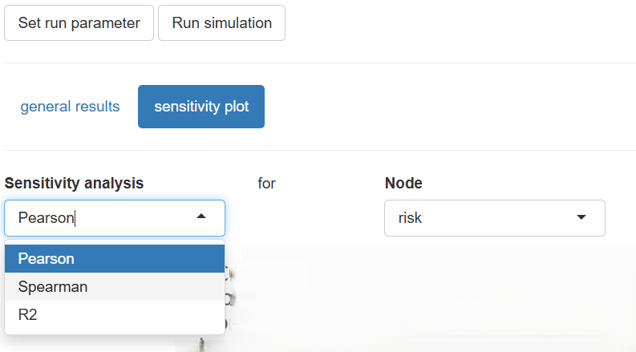
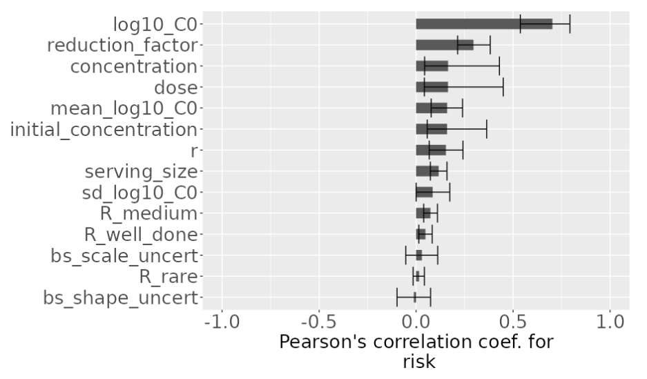

# Running a simulation

::: {.callout-note appearance="minimal"}
#### This section will introduce you to

-   setting simulation parameters to enhance the efficiency  
- obtaining model result interface
-   interpreting model results
-   Interpreting sensitivity analysis
:::

Start the simulation to change the default simulation settings and get the results of your model.

{#fig-simulation width="100%"}

## Simulation settings

Before running the simulation, you may **set run parameters** to control the default settings of the simulation. This can be useful to increase the efficiency of the simulation. Depending on whether your model involves a one-dimensional (1D) or two-dimensional (2D) simulation, the number of replicates is given in general or separately for variability and uncertainty (@fig-setrunparameter).      

::: {#fig-setrunparameter layout-ncol=2}

{width="100%"}

{width="100%"}

Setting run parameters for a one-dimensional (1D) and two-dimensional (2D) simulation.
:::

|                                                                                         |                                                                                                       |
|---------------------------------|--------------------------------------|
| [Sampling technique]{style="color:#0d6efd"}                                             | Choose between Monte-Carlo (default) and latin hypercube (enhanced efficiency)             |
| [Number of replicates[\*]{style="color:Red"}]{style="color:#0d6efd"} | Enter the number of random samples for all distribution nodes  (1D model)                        |
| [Number of replicates[\*]{style="color:Red"} for variability]{style="color:#0d6efd"} | Enter the number of random samples for nodes reflecting variability (2D model)                        |
| [Number of replicates[\*]{style="color:Red"} for uncertainty]{style="color:#0d6efd"} | Enter the number of random samples for nodes reflecting uncertainty (2D model)                        |
| [Seed value]{style="color:#0d6efd"}                                                     | Enter an integer number, which will allow to reproduce the random sampling results  | [Quantiles]{style="color:#0d6efd"}                         | Enter comma-separated  percentiles for summarizing model results in the variability (1D) and uncertainty (2D) |
| [Type]{style="color:#0d6efd"}   | Select quantile algorithm for calculating the percentiles|
| [\*]{style="color:Red"}                              | "Monte Carlo iterations" will be replaced with "replicates" since this applies to both Monte Carlo and latin hypercube sampling.

: {tbl-colwidths="\[30,70\]"}

The setting of the **Sampling technique**,  Monte Carlo (MC) versus mid latin hypercube (LH), is a technicality that can be ignored unless you have a specific preference (read more about sampling method below). 

The **Number of replicates** allows you to to set the sample size for the simulation that is adequate for the modelling task (read more about number of replicates below). 

Documentation of the **Seed value** allows you to exactly reproduce the numerical results of your model. This is possible because the random number generation uses a fully deterministic process. However, for practical purposes, the numbers generated using both the MC and LH algorithms can be assumed to be random, independent and identically distributed. The term "random" sample will be used for both MC and LH sampling techniques.

The default setting of the **Type** for calculating percentiles follows the recommendation given by the developers of R's "quantile" function (see [documentation](https://www.rdocumentation.org/packages/stats/versions/3.6.2/topics/quantile)), which is part of the R "stats" package (R Core Team, 2024. R: A Language and Environment for Statistical Computing. R Foundation for Statistical Computing, Vienna, Austria. <https://www.R-project.org/>).

::: {.callout-warning appearance="simple"}
#### Memory

The shiny rrisk server allocates a fixed size of memory to run the simulation. The amount of memory used is influenced by the number of nodes and the number of samples requested in the variability and uncertainty dimensions.
:::

::: {.callout-tip collapse="true"}
### Good practice - Number of replicates 

Since the number of nodes is given by the structure of the model, the amount of memory used will mainly depend on the number of random samples. Usually, the number of samples is selected based on standard "magic" numbers, like 100, 1000, 10000, etc. However, there are some approaches that can be followed as a guidance to estimate an approximate number. For the first approach you need the probability of the event being modelled as outcome (which is typically low in risk and exposure assessments) and the minimum expected **number of events you wish to model** to obtain a statistically meaningful result. Let $p$ denote the (low) true risk and $n$ the minimum expected number of occurrences of the event you wish to model. You can approximate the required number of replicates $N$ using 

$$N\ge n/p.$$

For example, to observe at least $n=5$ events with a $p = 1/10000=10^{-4}$, you will need $N\ge=5*10^4$, at least 50,0000 samples. Finding the appropriate number of samples is an iterative process, where different simulations are run until consistent values for up to two/three digits of the mean or median are obtained. The second and more general approach for assessing the required number of replicates uses the **convergence plot** (see below).  The convergence plot displays the numerical result of you model as a function of the number of replicates. Therefore, this approach is also applicable if some other metric than number of adverse events is used as outcome of the model.
:::

::: {.callout-tip collapse="true"}
### Good practice - Choice of percentiles for numerical results

The median as a measure of central tendency and 95th percentile for characterizing the spread towards more extreme outcomes are usually  reported to characterize the variability  of the outcome in exposure or  risk models. If a 2D simulation has been conducted to account for parameter uncertainty, these outcome statistics are usually reported with a 95% uncertainty interval, i.e. an interval ranging from the 2.5th to the 97.5th percentile of the uncertainty distribution. If this interval is too wide to convey useful information, more narrow symmetrical intervals such as 10th and 90th percentile may be appropriate.   
:::

::: {.callout-caution collapse="true"}
## Read more - Monte Carlo (MC) vs. latin hypercube (LH) sampling

Two sampling methods can be used in shiny rrisk. The Latin Hypercube (LH) method is more efficient and will provide the same accuracy as the Monte Carlo (MC) method with fewer samples. In addition the LH will assure that samples are taken from the whole distribution, which is also better for rare events. The LH might reduce the number of samples required by a factor of 10 compared with the MC method. The LH is the default method in shiny rrisk.

The LH method divides each random variable's range into equal probability intervals (strata) according the number of samples required in the simulation and then take one sample from each interval per variable. Then the full coverage of each variable is sampled.

@fig-mc_lh_v2 shows two input parameters of the simple risk model $\mbox{Risk}=X_1*X_2$. Note that even with a small number of 80 sampling replicates, LH sampling results in a more homogeneous coverage of the sampling space as compared to the MC method.

{width="100%" #fig-mc_lh_v2}

The table below compare the sampling methods to the true risk after taken 80 samples for the two input variables. The risk estimated using LH sampling is more accurate than the MC estimate. 

|     Method      | Sample Size | Mean Risk | S.E.  |
|:---------------:|:-----------:|:---------:|:-----:|
|      True       |    ----     |   0.017   |  \-   |
|   Monte Carlo (MC)  |     80      |   0.038   | 0.021 |
| Latin Hypercube (LH) |     80      |   0.013   | 0.012 |
:::

## Run simulation 

After setting all the parameters, select **Run Simulation.** After the simulation is completed, shiny rrisk will present  **general results** and **sensitivity plot.**

### General results 

Under **general results** you can access the numerical as well as the graphical results of your model. The end node (final outcome of your model) is shown by default. The results of any other node can be shown by selecting the **Node** from the drop-down menu.

#### One-dimensional (1D) simulation

Shiny rrisk conducts a one-dimensional (1D) simulation, if none of the distribution nodes is defined to represent uncertainty. In this case, the numerical outcome consists of only one row of results, the **mean**, **median**, standard deviation (**sd**), a selection of **percentiles** (see Simulation settings) as well as the **unit**. This is shown using the  *Yersinia enterocolitica* in minced meat model as example. The median and 95th percentile of the outcome (N_cg) is 0 and 89 colony forming units (CFU), respectively (@fig-general_results_out_1D).

{#fig-general_results_out_1D width="100%"}

#### Two-dimensional (2D) simulation

Shiny rrisk conducts a two-dimensional (2D) simulation, if at least one of the distribution nodes is defined to represent uncertainty. In this case, the numerical outcome consists of columns as defined for 1D models (see above) and rows for the **mean**, **median**, standard deviation (**sd**), a selection of **percentiles** for the uncertainty dimension  (see Simulation settings). This is shown using the  *E. coli* in beef patties model  as example. The 90% uncertainty interval for median and 95th percentile for the outcome (risk) is 0.003-0.087 and 0.442-1.0, respectively (@fig-general_results_out_2D).

{#fig-general_results_out_2D width="100%"}

::: {.callout-caution collapse="true"}

## Read more - Interpretation of percentiles  
Percentiles of the outcome function evaluated using shiny rrisk can be regarded as unbiased in a statistical sense. This property of probabilistic modelling is advantageous in comparison to a deterministic approach that would give you a biased result under general conditions. 

Assume you were interested in the high, say 95th percentile of the outcome distribution. This is typically the case to account for the high end of the range of outcomes consistent with the information captured in the model. Using a **deterministic approach**, you would use the "high risk percentiles" for each of the input variables. Multiplying the 95th percentiles of two random variables results in a larger value compared to the 95th percentile of the simulated product if the two factors are uncorrelated. Thus, the deterministic approach for evaluating high percentiles is biased towards high risk outcome. 

This effect is demonstrated using illustrative distributions representing variability in food consumption (FC) and substance concentration (SC). The product of the 95th percentiles is an overestimation of the 95th percentile of the exposure Ex=FC*SC (@fig-BiasedP95).  

{#fig-BiasedP95 width="100%"}

:::

### Graphical results

#### Histogram

This plot depicts the density distribution of the random values for a given node.

{style="border: 2px solid black;  box-shadow: 4px 4px 12px rgba(0, 0, 0, 0.6);" width="500"}

#### ECDF plot

This is the empirical cumulative density function plot, it is presented as an ascending cumulative plot. See read more for the proper interpretation of the graph.

{style="border: 2px solid black;  box-shadow: 4px 4px 12px rgba(0, 0, 0, 0.6);" width="500"}

#### Convergence plot

@Robert - how to interpret this one?

{style="border: 2px solid black;  box-shadow: 4px 4px 12px rgba(0, 0, 0, 0.6);" width="500"}

::: {.callout-caution collapse="true"}
## Read more - 2D MC Models

The following figure depicts the outcome of a probabilistic model that reflects both variability and uncertainty (2D MC). 

The central tendency (median) of the risk estimate can be read from the intersection of the dark blue line with the red line parallel to the x-axis at a probability value in the y-axis of 0.5. The value is around 1e-11.

The 95th percentile (P95) provides an estimate of the risk that captures 95% of the variability of the input parameters. It can be read from the graph by looking at the x-axis where upper red lines intersects with the dark blue line.

The uncertainty of the median and 95th can be read from range of values across the red lines for each statistic. The red lines represents the 95% probability intervals for the median and 95th percentile. For instance, the upper boundary of a 95 % uncertainty range for the P95 estimate when accounting for uncertainty is 1e-10.
:::

#### Sensitivity Plot

{style="border: 2px solid black;  box-shadow: 4px 4px 12px rgba(0, 0, 0, 0.6);" width="500"}

The sensitivity analyses results can be visualized by selecting the **sensitivity plot** tab in the main screen after running the simulation. Shiny rrisk will produce a tornado plot using two stasticts, "Pearson correlation coefficient" and "Spearman rho statistic" (the R2 statistic will be implemented in future versions of shiny rrisk).

The following plots presents the 2D tornado plot using the Pearson statistic for the E. coli model. All the input variables are postively correlation withe outcome (eg. the larger is the value of the input, the larger is the risk). However there are major differences in the influence of each input variable on the outcome. For instance the initial concentration of the pathogen (log10_C0) has a Pearson correlation coefficient of approximately 0.6 followed by the reduction facors and concentration.

Since this is a 2D model, the tornado plot also present the 95%. probability interval due to the uncertainty of the risk outcome.

{style="border: 2px solid black;  box-shadow: 4px 4px 12px rgba(0, 0, 0, 0.6);" width="500"}

::: {.callout-caution collapse="true"}
## Read more: Tornado plots

Tornado plots are commonly used in risk and exposure assessments models to assess the quantify the impact of input variables on the outcome of the model. This relationship is quantified using parametric (eg. Pearson correlation coefficient) or non-parametric (eg. Spearman rank correlation coefficient - rho -) statistics.

The graphs is created using all the input variables on the y-axis and the statistic on the x-axis, then the relationship is depicted using horizontal bars where the length of the bar represents the value of the statistic. This value is constraint by the boundaries of the statistic (eg. between -1 and 1). Where values below 0 represent an inverse relationship and values greater than 0, otherwise. For instance negative values suggest that higher values of the input are associates with lower values of the outcome variable.

In addition, for 2D models, each input variable has a line indicating the 95% probability interval of the relationship due to the uncertainty propagated in the model.

**Pearson correlation coefficient**. The relationship is captured assuming a linear relationship between the input variable and the outcome using the Pearson correlation coefficient.

**Spearman rank correlation**. The relationship is captured using the non-parametric rank correlation which does not assume any particulate shape of the relationship between the input and outcome.

This graphs are called "tornado" because the shape of the graphs resembles a "tornado", funnel like shape since the variables ara sorted from highest values on the top to the lowest at the bottom.
:::

