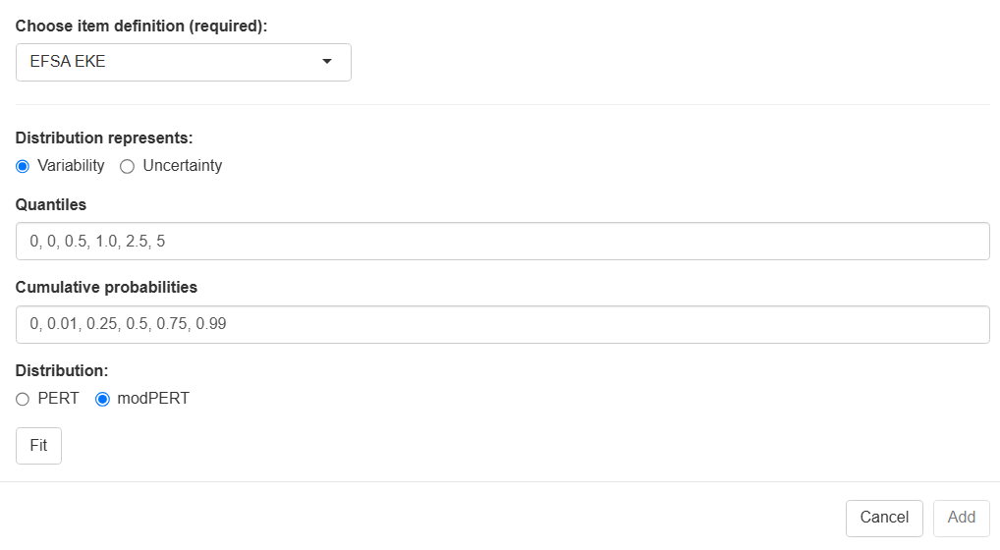
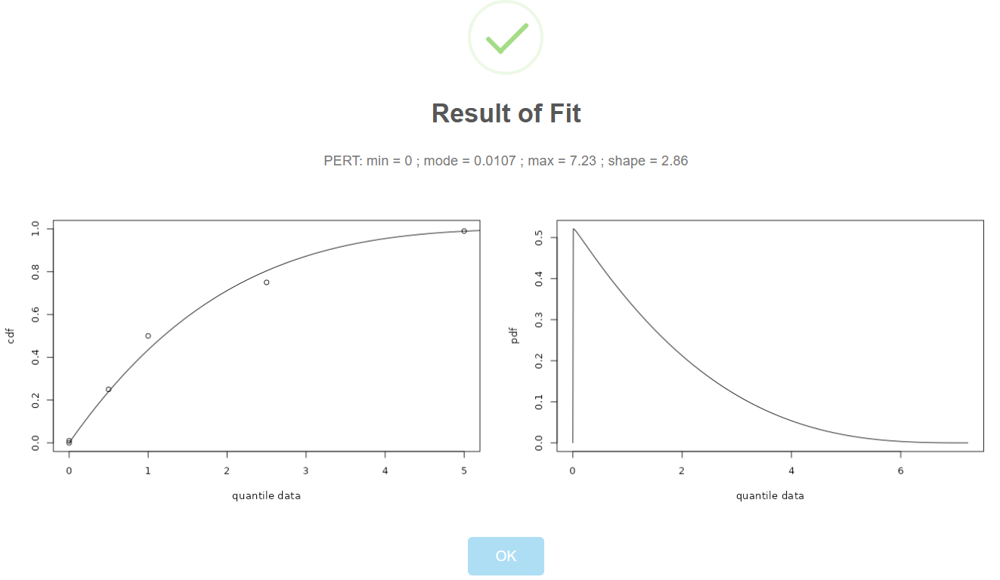

# Getting started

::: {.callout-note appearance="minimal"}
#### This section will introduce you to

- fitting a distribution to empirical data, 
- fitting a distribution to your original data or expert knowledge  elicitation results, 
- generating the documentation and 
- transferring the fitting objects into your shiny rrisk session.  

:::

{#fig-distributionfitting width="100%"}

|                                |                                                                                                                            |
|-----------------|-------------------------------------------------------|
| [NEW]{style="color:#0d6efd"}   | Click here if you wish to create a new distribution fitting project.                                                      |
| [OPEN]{style="color:#0d6efd"}  | Open a csv-data file containing your original observations or a rrisk-dist file if you want to modify a distribution fitting project that you have created and downloaded. |
| [SAVE]{style="color:#0d6efd"}  | Download the fitting project, report or export to shiny rrisk session.                                                     |
| [ABOUT]{style="color:#0d6efd"} | Check out here for a disclaimer, manual and contact information.                                                           |

: {tbl-colwidths="\[10,90\]"}

Click **NEW** to start a new fitting project. shiny rrisk distributions supports two approaches for fitting a distribution (@fig-distributionfitting). The first approach allows you to fit a probability density function (pdf) to a sample of empirical observations. The app then helps you to identify and parameterise candidate distributions that fit the provided data. The second approach involves fitting a cumulative density function (cdf), for which you will define the required percentiles. The percentiles may be generated using an expert knowledge elicitation (EKE). The percentiles are then used as support points for distribution fitting. 

|                                |                                                                                                                            |
|-----------------|-------------------------------------------------------|
| [pdf]{style="color:#0d6efd"}  | Choose this option when you have original data, typically a sample from a population of observations. |
| [cdf]{style="color:#0d6efd"}  | Choose this option when you have percentiles, e.g. from an EKE process.                                                      |

: {tbl-colwidths="\[10,90\]"}

::: {.callout-warning appearance="simple"}
#### One distribution fitting project for each distribution 

In a session with the application, one distribution can be fitted at a time, which can be used to inform a distribution node in the shiny rrisk application. Consequently, each fitted distribution in shiny rrisk is documented with a corresponding distribution fitting object.
:::

# Fitting a probability density function (pdf)

### Distribution families and goodness of fit

The app currently supports the fit of Weibull, normal, gamma, triangular, log-normal, inverse gamma, cauchy and exponential distribution. You should be consult expert knowledge to select suitable candidate distributions for the data.

::: {.callout-caution collapse="true"}
## Read more

##### Akaike information criterion (AIC)

Given a collection of models for the data, AIC estimates the quality of each model, relative to each of the other models. Thus, AIC provides a means for model selection.(Wikipedia contributors, 'Akaike information criterion', Wikipedia, The Free Encyclopedia, <https://en.wikipedia.org/w/index.php?title=Akaike_information_criterion&oldid=1298064517> [accessed 30 June 2025])

:::

Suppose that we have a statistical model of some data. Let k be the number of estimated parameters in the model. Let L ^ {\displaystyle {\hat {L}}} be the maximized value of the likelihood function for the model. Then the AIC value of the model is the following.[4][5]

    A I C = 2 k − 2 ln ⁡ ( L ^ ) {\displaystyle \mathrm {AIC} \,=\,2k-2\ln({\hat {L}})}
    
    avg. neg. log-liklihood = 1.497

BIC
comparison of AIC/AICc and BIC is given by Burnham & Anderson (2002, §6.3-6.4), with follow-up remarks by Burnham & Anderson (2004). The authors show that AIC/AICc can be derived in the same Bayesian framework as BIC, just by using different prior probabilities. In the Bayesian derivation of BIC, though, each candidate model has a prior probability of 1/R (where R is the number of candidate models). Additionally, the authors present a few simulation studies that suggest AICc tends to have practical/performance advantages over BIC. 

{\displaystyle \mathrm {BIC} =k\ln(n)-2\ln({\widehat {L}}).\ }

Example 

The exposure model of Alizarin red in eel contains the node X based on 19 observed individual intake  values of eel per kg body weight derived from 24h-recall data of the German National Consumption Survey II (MRI, 2008). This model demonstrates the advanced concept of using bootstrap to obtain uncertainty distribution for the log mean and log standard deviation. Now let’s explore a simpler approach, which is to use the 19 original intake values directly for distribution fitting (@fig-fitlognormal). 

A log-normal distribution provides the best fit according to the AIC statistic. This result is consistent with the use of .. and BIC criterion (results not shown). The parameters of fitted log-normal distribution are  and respectively. Upon pressing .. the results can be exported to a shiny risk session. In shiny rrisk, a parametric distribution node is generated from the imported fitting object (@fig-importedfit).

This, 

Von meinem iPad gesendet

# Fitting a cumulative density function (cdf)

### Expert knowledge elicitation (EKE)

::: {.callout-note appearance="minimal"}
This section demonstrates how you can use typical results from an expert elicitation to parameterise a node in shiny rrisk [Needs major revision when the distribution app becomes available; Olaf Mosbach-Schulz should review the section]{.mark}.
:::

{#fig-EKE0 width="100%"}

|                                                  |                                                                                                             |
|-----------------------|-------------------------------------------------|
| [Choose node definition]{style="color:#0d6efd"}  | [to be updated]{.mark} Select EFSA EKE.                                                                     |
| [Distribution represents]{style="color:#0d6efd"} | Select either variability or uncertainty.                                                                   |
| [Quantiles]{style="color:#0d6efd"}               | Enter any number of quantiles, comma-separated.                                                             |
| [Cumulative probability]{style="color:#0d6efd"}  | Enter one cumulative probability for each of the quantiles, beginning with the value zero, comma-separated. |

: {tbl-colwidths="\[20,80\]"}

#### Defining an EFSA EKE node in shiny rrisk

The European Food Safety Authority (EFSA) have described a process for eliciting expert knowledge (REF). The use of EFSA EKE node involves three steps.

1.  Conduct of the EFSA EKE protocol, which includes the definition of a target quantity, elicitation protocol and results in the descdocumenting the data source and defining node names and corresponding statistics.
2.  A distribution node parameterised using input from an EFSA EKE may refer to variability or uncertainty, depending on the question formulation of the EKE process. The final result of the EKE consists of five percentiles that to be entered manually for fitting a Pert distribution (@fig-EKE0). Details are illustrated using the example below.

::: {.callout-note collapse="true"}
### Example for EFSA EKE (L. lignosellus in asparagus)

(@fig-EKE1).

{#fig-EKE1 width="100%"}

The three steps in this example are the following.

1.  Defining the bootstrapping node [X]{.underline}, providing a data source and requesting the two nodes [Xmean]{.underline} and [Xsd]{.underline} for the mean and standard deviation, respectively (@fig-BootstrapNode2).
2.  Generating two nodes containing the bootstrap distributions [Xmean]{.underline} and [Xsd]{.underline} (automatically by shiny rrisk).
3.  Using the two nodes for defining a new node [C]{.underline} for the population variability in consumption of eel per body weight consumed on single meal (@fig-ARSnodeC).

{#fig-EKE2 width="100%"}
:::

::: {.callout-caution collapse="true"}
## Read more

#### EFSA EKE

[@O or Thomas to contribute] Brief description of the EFSA EKE or more description how shiny rrisk deals with EKE more generally.
:::

# Documentaion and transfer to shiny rrisk 
The results of the fitting procedure can be imported into a shiny rrisk session.
