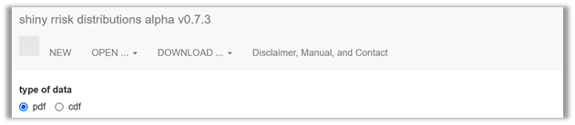
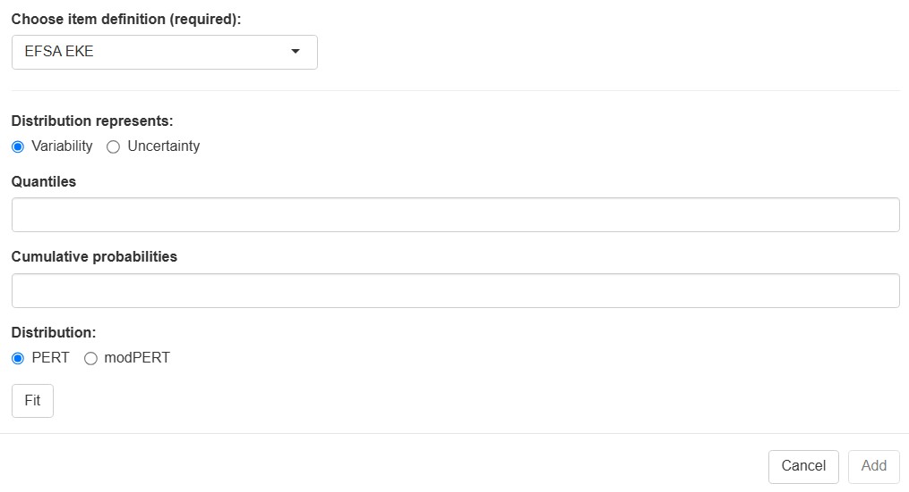

# Getting started

::: {.callout-note appearance="minimal"}
#### This section will introduce you to

- fitting a distribution to your original  data or expert knowledge elicitation results  
:::


{#fig-distributionfitting width="100%"}


Shiny rrisk distributions supports two approaches for fitting a distribution (@fig-distributionfitting). The first approach, fitting a probability density function (pdf), requires a sample of empirical observations to be uploaded. The app then supports the identification and parameterisation of the candidate distributions. The second approach, fitting a cumulative density function (cdf), requires the definition of percentiles, which are than used as support points for distribution fitting. The latter option is also applicable for fitting a distribution to the results of a expert knowledge elicitation (EKE).  In both cases, the results of the procedure can be imported into a shiny rrisk session. 

|                                |                                                                                                                            |
|-----------------|-------------------------------------------------------|
| [pdf]{style="color:#0d6efd"}  | Choose this option when you have original data, typically a sample from a population of observations. |
| [cdf]{style="color:#0d6efd"}  | Choose this option when you have percentiles, e.g. form an EKE process.                                                      |

: {tbl-colwidths="\[10,90\]"}

## Fitting a probability density function (pdf) 

::: {.callout-note appearance="minimal"}
#### This section will introduce you to

- fitting a robability density function (pdf) to some empirical data
:::


## Fitting a cumulative density function (cdf)

::: {.callout-note appearance="minimal"}
#### This section will introduce you to

- fitting a cumulative  density function (cdf) to percentiles
:::


### Expert knowledge elicitation (EKE)

::: {.callout-note appearance="minimal"}
This section demonstrates how you can use typical results from an expert elicitation to parameterise a node in shiny rrisk [Needs major revision when the distribution app becomes available; Olaf Mosbach-Schulz should review the section]{.mark}.
:::

{#fig-EKE0 width="100%"}

|                                                  |                                                                                                             |
|-----------------------|-------------------------------------------------|
| [Choose node definition]{style="color:#0d6efd"}  | [to be updated]{.mark} Select EFSA EKE.                                                                     |
| [Distribution represents]{style="color:#0d6efd"} | Select either variability or uncertainty.                                                                   |
| [Quantiles]{style="color:#0d6efd"}               | Enter any number of quantiles, comma-separated.                                                             |
| [Cumulative probability]{style="color:#0d6efd"}  | Enter one cumulative probability for each of the quantiles, beginning with the value zero, comma-separated. |

: {tbl-colwidths="\[20,80\]"}

``` (r)
d -> choose(3,3)
print(d)
```

#### Defining an EFSA EKE node in shiny rrisk

The European Food Safety Authority (EFSA) have described a process for eliciting expert knowledge (REF). The use of EFSA EKE node involves three steps.

1.  Conduct of the EFSA EKE protocol, which includes the definition of a target quantity, elicitation protocol and results in the descdocumenting the data source and defining node names and corresponding statistics.
2.  A distribution node parameterised using input from an EFSA EKE may refer to variability or uncertainty, depending on the question formulation of the EKE process. The final result of the EKE consists of five percentiles that to be entered manually for fitting a Pert distribution (@fig-EKE0). Details are illustrated using the example below.

::: {.callout-note collapse="true"}
### Example for EFSA EKE (L. lignosellus in asparagus)

(@fig-EKE1).

{#fig-EKE1 width="100%"}

The three steps in this example are the following.

1.  Defining the bootstrapping node [X]{.underline}, providing a data source and requesting the two nodes [Xmean]{.underline} and [Xsd]{.underline} for the mean and standard deviation, respectively (@fig-BootstrapNode2).
2.  Generating two nodes containing the bootstrap distributions [Xmean]{.underline} and [Xsd]{.underline} (automatically by shiny rrisk).
3.  Using the two nodes for defining a new node [C]{.underline} for the population variability in consumption of eel per body weight consumed on single meal (@fig-ARSnodeC).

{#fig-EKE2 width="100%"}
:::

::: {.callout-caution collapse="true"}
## Read more

#### EFSA EKE

[@O or Thomas to contribute] Brief description of the EFSA EKE or more description how shiny rrisk deals with EKE more generally.
:::

