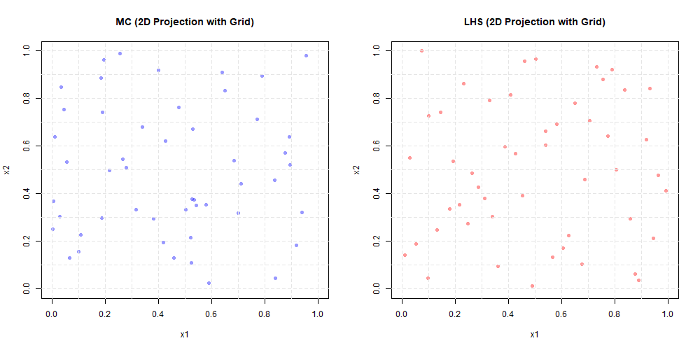
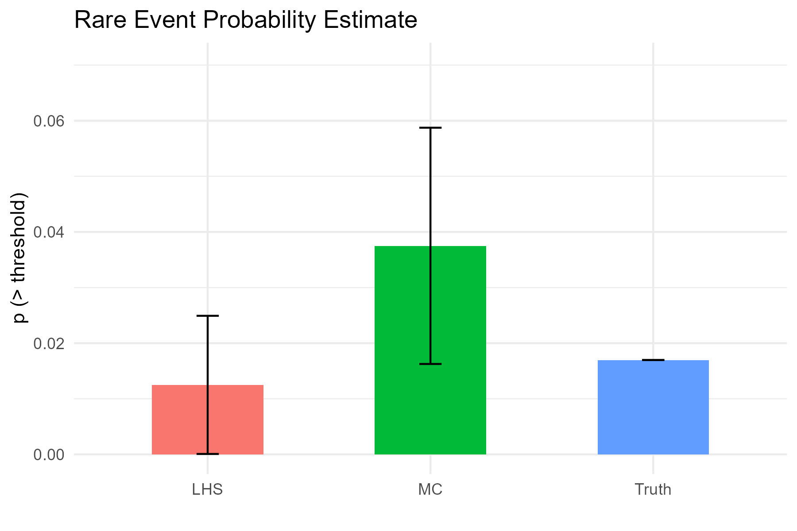
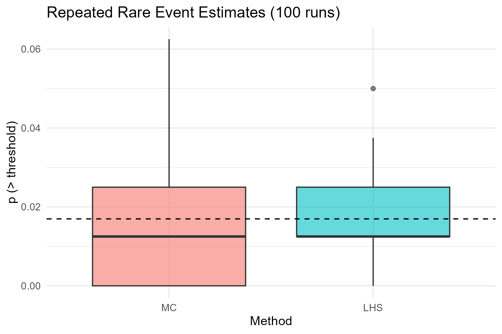

# Sampling Efficiency Report: Monte Carlo vs Latin Hypercube

## 1. Input Space Coverage (2D Projections)

## 2. Single Estimate Comparison

| Method | Estimate | Std. Error |
|--------|----------|------------|
| Truth  | 0.016965 | NA         |
| MC     | 0.037500 | 0.021241 |
| LHS    | 0.012500 | 0.012422 |

## 3. Bar Plot: Estimate vs Truth

## 4. Repeated Estimates (100 Trials)

